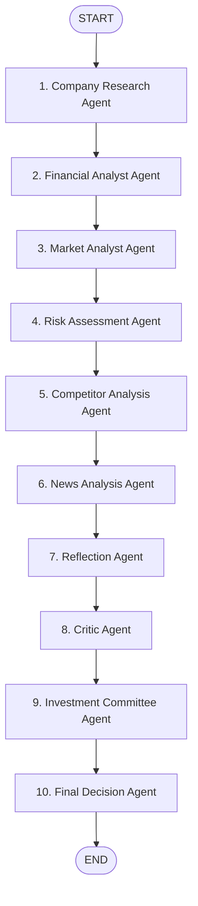

# System Architecture

This document describes the structural design of the **InvestIQ AI Investment Research Terminal**.

## 1. Multi-Agent Orchestration Layer (`ai/`)
The AI engine utilizes `StateGraph` from `@langchain/langgraph` to orchestrate 10 specialized agent roles in a sequential workflow.

### State Schema (`ai/src/graph/state.ts`)
The shared state object stores the progressive output of the pipeline:
- **`company`**: Original user search string.
- **`ticker`**: Extracted equity stock symbol.
- **`financials`**: Parsed balance sheets and chart arrays.
- **`companyOverview`**: Overview details (CEO, HQ).
- **`financialAnalysis` / `marketAnalysis` / `riskAnalysis` / `competitorAnalysis` / `newsAnalysis`**: Core analyst reports.
- **`reflectionNotes`**: Self-evaluation from the Reflection Node.
- **`criticisms`**: Sketpical counter-arguments from the Critic.
- **`committeeVotes`**: Votes and reasons cast by simulated Growth, Value, and Risk Partners.
- **`finalRecommendation`**: Synthesized JSON recommendation block.
- **`logs`**: List of progression logs to stream loading status details to the UI.

---

## 2. Abstraction Provider (`ai/src/llm/provider.ts`)
The application supports a clean adapter abstraction layer. By default, it requests **Google Gemini 2.5 Pro** (`gemini-2.5-pro` model) using the `@langchain/google-genai` integration. 

By simply swapping the `LLM_PROVIDER` environment variable to `"openai"`, the provider dynamically imports `@langchain/openai` and swaps the target model to `gpt-4o` without altering a single line of agent prompts.

---

## 3. Storage Repository Pattern (`backend/src/models/historyRepository.ts`)
To make local evaluation and deployment effortless, the database layer routes all requests through a unified **HistoryRepository** wrapper. 
- If MongoDB is running (e.g., local daemon on port 27017), the repository stores and queries records using standard **Mongoose Models**.
- If MongoDB is offline, the repository automatically saves and deletes data in a local JSON database file (`history_db.json`) located at the project root directory.

---

## 4. UI Dashboard and Visualizations (`frontend/`)
The frontend is a single-page React app that maps:
1. **Interactive Gauges**: Radial charts and custom gauges for score indexes.
2. **Recharts Modules**:
   - **Area Chart**: Revenue growth and Net Income trends over the last 4 years.
   - **Bar Chart**: Key profitability ratios (Gross margin, operating margin, Net margin, ROE).
   - **Pie Chart**: Allocation of risk dimensions (Financial, Operational, Regulatory, Market).
   - **Radar Chart**: Comparison of strategic dimensions (Multiple rating, moat scale, financial health, risk opposition, media sentiment).
3. **Voice Search**: Integrates native HTML5 Web Speech API to capture verbal lookup inputs.
4. **Portfolio Simulator**: LocalStorage state holding allocations.
5. **Side-by-Side comparison**: URL Search Parameter comparison drawer rendering metrics side-by-side.
